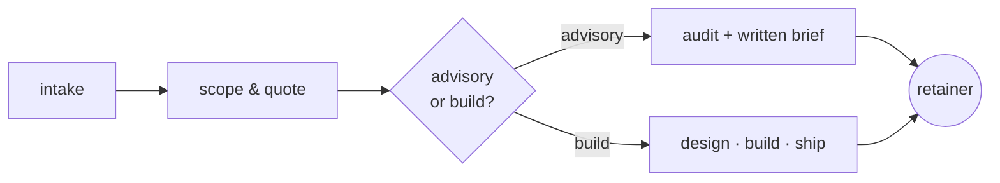

```
██████╗ ██╗  ██╗██████╗    │  severe code.
██╔══██╗██║ ██╔╝██╔══██╗   │  heavy deploys.
██████╔╝█████╔╝ ██████╔╝   │
██╔══██╗██╔═██╗ ██╔══██╗   │  hamburg · de
██████╔╝██║  ██╗██║  ██║   │  k3s · hetzner · go
╚═════╝ ╚═╝  ╚═╝╚═╝  ╚═╝   │
```

```yaml
bkr:
  lang:     [go, typescript, bash]
  frontend: [htmx, templ, tailwind]
  infra:    [kubernetes, k3s, hetzner, traefik]
  tools:    [neovim, podman, cert-manager]
  region:   hamburg.de
```

### currently

- shipping boring tech that doesn't page at 3am[^1]
- **go + templ + htmx** end-to-end — one language, one mental model
- small k3s clusters on hetzner — real workloads, sane bills
- running [**synkraft.co**](https://synkraft.co) — brand & digital systems
- hosting [**unionstack.dev**](https://unionstack.dev) — hosting & innovation

### consulting/

how an engagement actually runs — no decks, no discovery calls billed by the hour.



### public/

two repos earn the open badge — the rest is intentionally locked.

- **[neovim-config](https://github.com/BKR-dev/neovim-config)** &nbsp;·&nbsp; `lua` &nbsp; modular nvim built on lazy.nvim — lsp, treesitter, telescope, all the boring-good stuff. portable across machines.
- **[pentestContainer](https://github.com/BKR-dev/pentestContainer)** &nbsp;·&nbsp; `docker` &nbsp; self-contained pentest toolkit. spin up, recon, exploit in a sandbox, destroy. no host pollution.

### private/

~50 repos behind the wall. roughly split:

```
╭──────────────────────────────────────────────────────
│  client work    synkraft builds, brand systems, NDA
│  infra          k3s, hetzner, authelia, nextcloud —
│                 too much state in git history to flip
│  in progress    half-built tools not ready for review
│  scratch        bootcamps, leetcode, experiments
╰──────────────────────────────────────────────────────
```

open code here is intentional. not a portfolio.

### activity/

> [!NOTE]
> **the contribution graph is hidden by design.** 95% of commits land in private repos — public-only undersells, private-counted misleads. read what's open instead.[^2]

---

<div align="center">
<sub>
<code>~ </code>
<a href="https://unionstack.dev">unionstack.dev</a>
<code> · </code>
<a href="https://synkraft.co">synkraft.co</a>
<code> · </code>
hamburg, de
</sub>
</div>

[^1]: boring = postgres, go, plain html. not boring = your eight-microservice CRUD app for a form that emails a PDF.
[^2]: green squares are a deeply weird KPI. weekends should be quiet.
