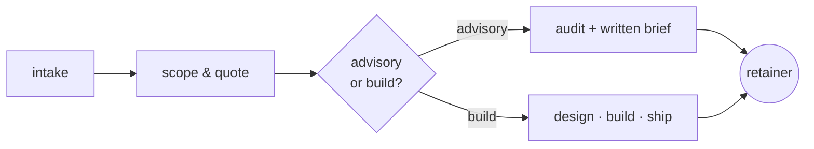

```
╭─ ~/bkr ──────────────────────────────────────────────╮
│                                                      │
│   ██████╗ ██╗  ██╗██████╗                            │
│   ██╔══██╗██║ ██╔╝██╔══██╗     severe code.          │
│   ██████╔╝█████╔╝ ██████╔╝     heavy deploys.        │
│   ██╔══██╗██╔═██╗ ██╔══██╗     no business cards.    │
│   ██████╔╝██║  ██╗██║  ██║                           │
│   ╚═════╝ ╚═╝  ╚═╝╚═╝  ╚═╝     hamburg · de          │
│                                                      │
╰──────────────────────────────────────────────────────╯
```

```console
$ whoami
solo operator. ships go, templ, htmx. runs the cluster.

$ uptime
12y+ in tech · 0 standups this week · cluster green

$ ps -ax | head -6
PID  CMD
001  go run ./cmd/synkraft
002  k3s-server
003  postgres
004  traefik
005  templ generate --watch
```

### now playing /

what's running, what's deprecated.[^1]

```diff
+ shipping boring tech that doesn't page at 3am
+ go + templ + htmx end-to-end — one language, one mental model
+ small k3s clusters on hetzner — real workloads, sane bills
+ running synkraft.co — brand & digital systems
+ hosting unionstack.dev — hosting & innovation
- microservices for a form that emails a PDF
- "we'll just use vercel for this"
- twelve-color tech-radar quadrants in the standup deck
```

### cat stack.yaml /

```yaml
languages:
  primary:    go          # one language all the way down
  secondary:  typescript  # when the browser insists, not before
  glue:       bash        # nothing else is honest about it

frontend:
  html:       templ       # types for a templating engine. yes.
  hypermedia: htmx        # the rest of the spa-pretending-to-be-a-thing
  style:      tailwind    # the css i actually finish writing

infra:
  orchestrator: k3s          # k8s for grown-ups, not f500 cosplay
  host:         hetzner      # bills you can read, bandwidth you can use
  ingress:      traefik
  certs:        cert-manager

datastore:
  default:    postgres    # the answer is almost always postgres
```

### consulting/

how an engagement actually runs — no decks, no discovery calls billed by the hour.



run by [**synkraft.co**](https://synkraft.co) &nbsp;·&nbsp; hosted on [**unionstack.dev**](https://unionstack.dev)

### ls -la public/

two repos earn the open badge — the rest is intentionally locked.

```
drwx------  bkr  neovim-config/      modular nvim, lazy.nvim, lsp, treesitter
drwx------  bkr  pentestContainer/   self-contained pentest sandbox, docker
```

- **[neovim-config](https://github.com/BKR-dev/neovim-config)** &nbsp;—&nbsp; modular config built on lazy.nvim. lsp, treesitter, telescope, all the boring-good stuff. portable across machines.
- **[pentestContainer](https://github.com/BKR-dev/pentestContainer)** &nbsp;—&nbsp; spin up, recon, exploit in a sandbox, destroy. no host pollution.

### ls -la private/

~50 repos behind the wall. roughly:

```
client/    synkraft builds, brand systems, nda-locked
infra/     k3s, hetzner, authelia, nextcloud — too much state in git
wip/       half-built tools not ready for review
scratch/   bootcamps, leetcode, experiments
```

open code here is intentional. not a portfolio.

### activity/

> [!NOTE]
> **the contribution graph is hidden by design.** 95% of commits land in private repos — public-only undersells, private-counted misleads. read what's open instead.[^2]

```console
$ git log --since='1 week ago' --oneline | wc -l
[redacted]
```

<p align="center">· · ·</p>

<div align="center">
<sub>
<code>~ </code>
<a href="https://unionstack.dev">unionstack.dev</a>
<code> · </code>
<a href="https://synkraft.co">synkraft.co</a>
<code> · </code>
hamburg, de · weekends are for the trees
</sub>
</div>

[^1]: boring = postgres, go, plain html. not boring = your eight-microservice CRUD app for a form that emails a PDF.
[^2]: green squares are a deeply weird KPI. weekends should be quiet.
